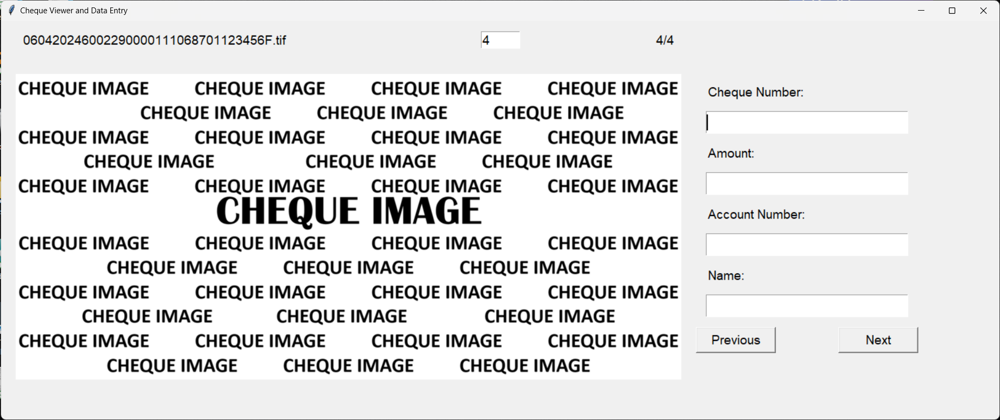
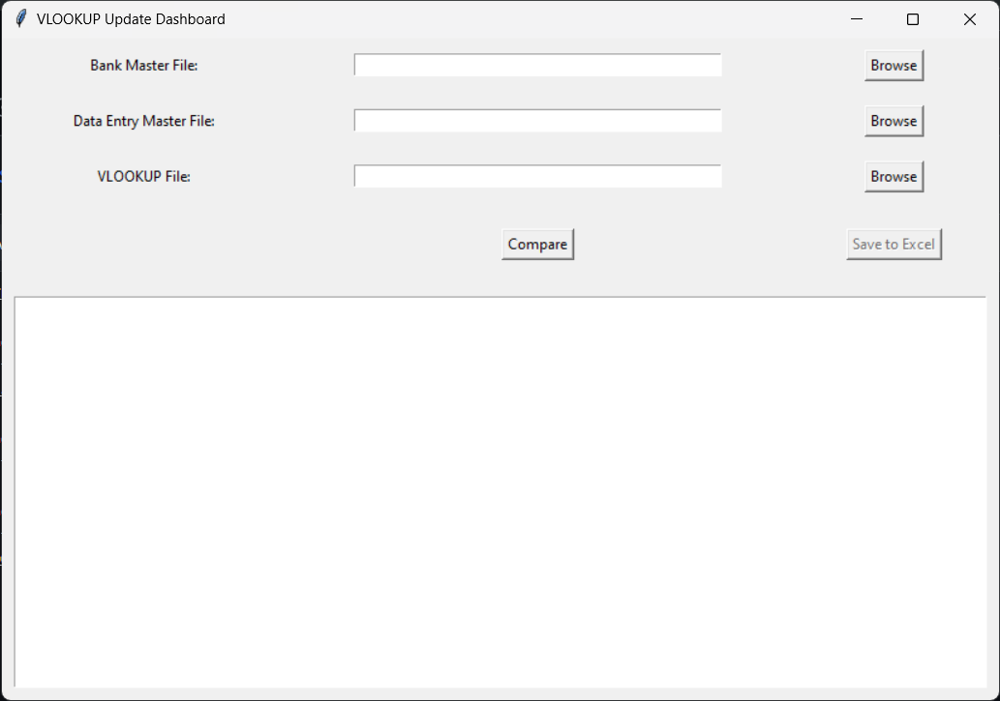

# [ITESKUL](https://www.iteskul.com/)

## [Cheque/data_entry.py](https://github.com/sojith29034/Iteskul-Softcom/blob/main_branch/Cheque/data_entry.py)
Select the folder containing cheque images.

## [Cheque/merge_files.py](https://github.com/sojith29034/Iteskul-Softcom/blob/main_branch/Cheque/merge_files.py)
Select the folder containing Excel/CSV files or zipped folders. A master file is given as output.

## [Cheque/vlookup.py](https://github.com/sojith29034/Iteskul-Softcom/blob/main_branch/Cheque/vlookup.py)
Select the respective master files and the previous vlookup(except the first time), compare those and save to new excel file.

## [Salary Calculation/calculate_salary.py](https://github.com/sojith29034/Iteskul-Softcom/blob/main_branch/Salary%20Calculation/calculate_salary.py)

## [StudentData/index.py](https://github.com/sojith29034/Iteskul-Softcom/blob/main_branch/StudentData/index.py)
### [Batch Report @ https://iteskul.streamlit.app/](https://batch-report.streamlit.app/)
