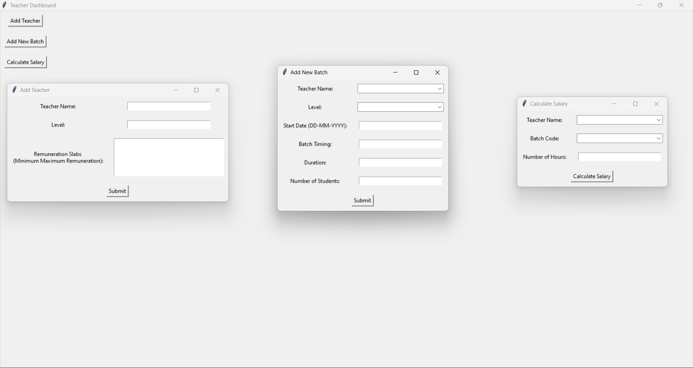

# [ITESKUL](https://www.iteskul.com/)

## Cheque/data_entry.py
Select the folder containing cheque images.

## Cheque/merge_files.py
Select the folder containing Excel/CSV files or zipped folders. A master file is given as output.

## Cheque/vlookup.py
Select the respective master files and the previous vlookup(except the first time), compare those and save to new excel file.

## Salary Calculation/calculate_salary.py

